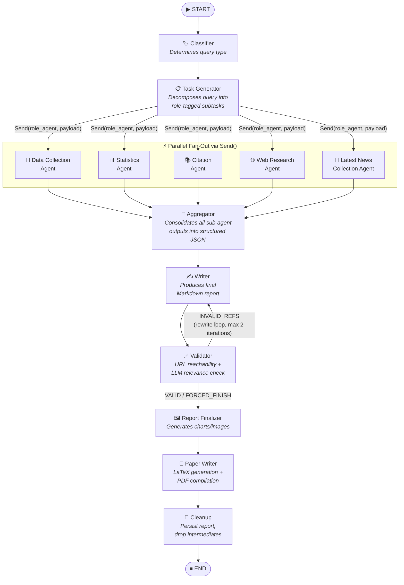
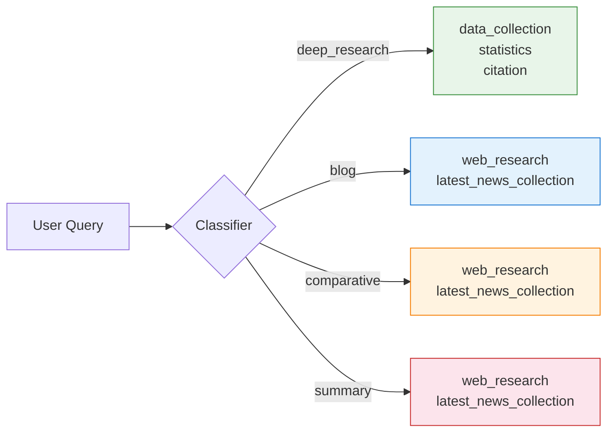
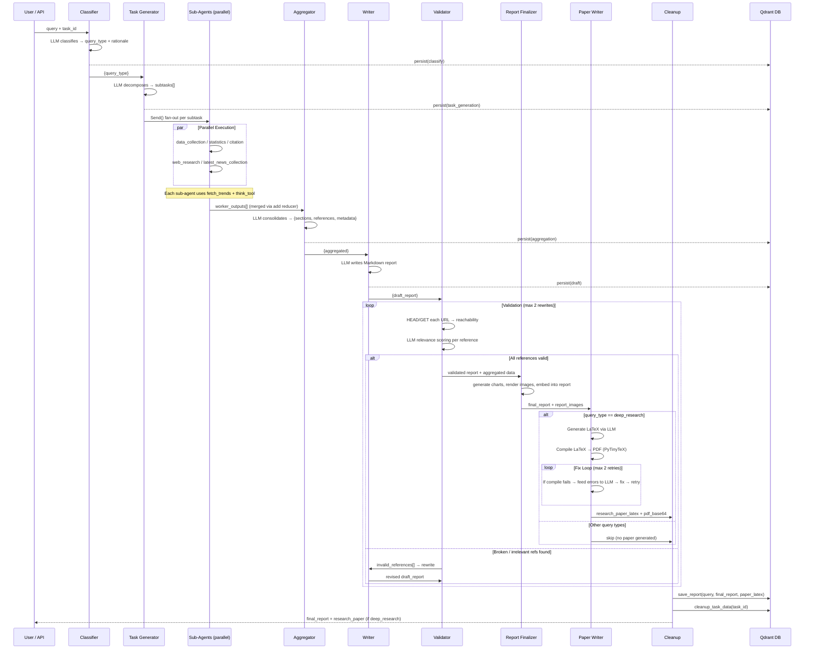
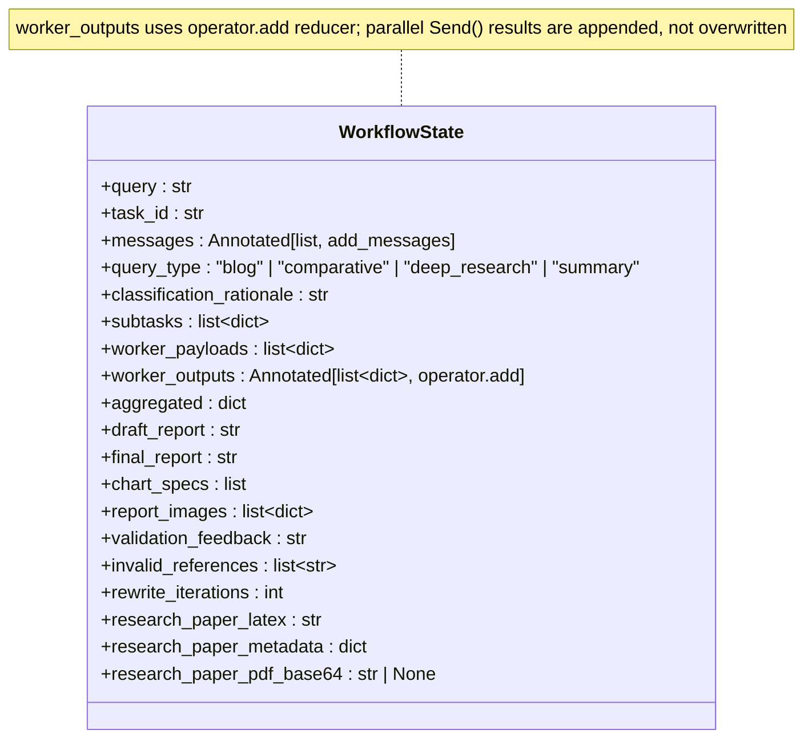
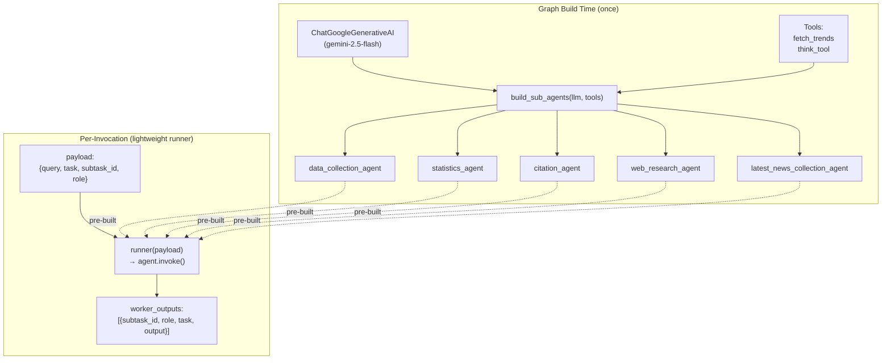
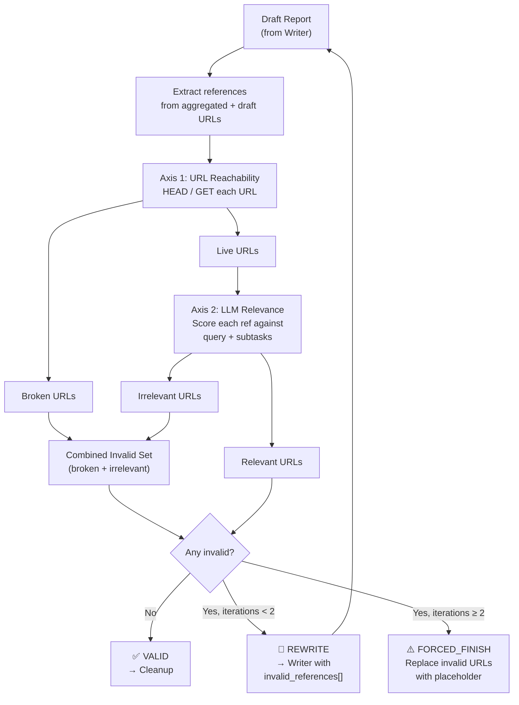
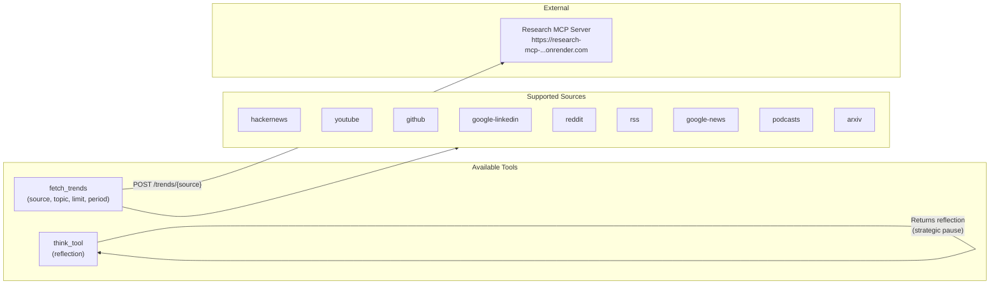
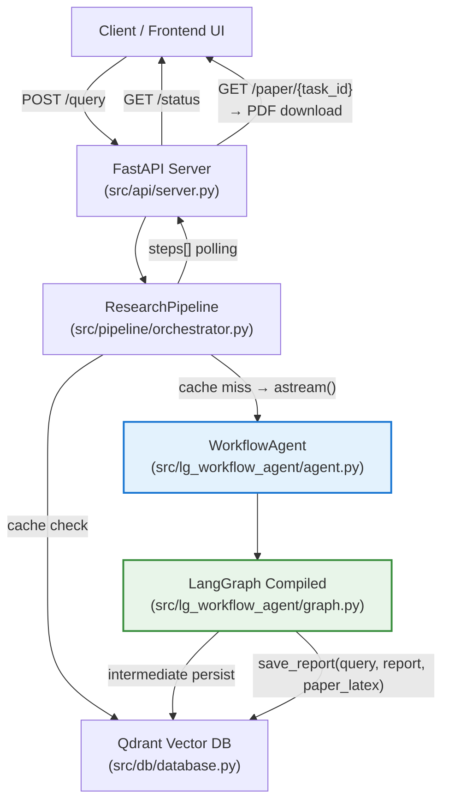
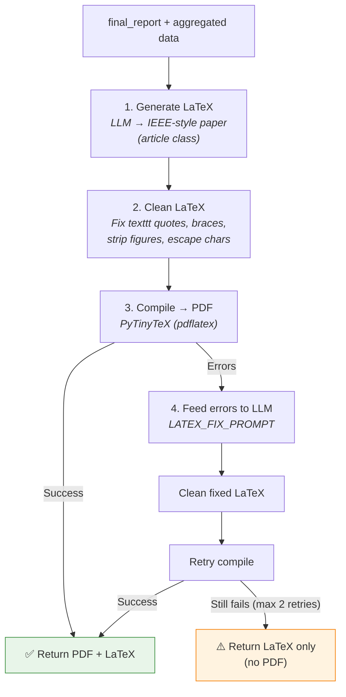

# LG Workflow Agent — Architecture & Flow

Complete architecture reference for the **LangGraph multi-agent research workflow** (`src/lg_workflow_agent/`).

---

## 1. High-Level Graph Flow



---

## 2. Query-Type Role Mapping

The **Classifier** assigns one of four query types. Each type activates a different subset of sub-agents for the parallel fan-out:



| Query Type | Activated Sub-Agents | Use Case |
|---|---|---|
| `deep_research` | `data_collection`, `statistics`, `citation` | Rigorous, citation-heavy investigation |
| `blog` | `web_research`, `latest_news_collection` | Informal/explanatory article |
| `comparative` | `web_research`, `latest_news_collection` | Compare/contrast entities or tools |
| `summary` | `web_research`, `latest_news_collection` | Short factual digest or overview |

---

## 3. Detailed Node-by-Node Flow



---

## 4. State Schema

All data flows through a single `WorkflowState` (TypedDict). Key fields and their reducers:



| Field | Set By | Consumed By |
|---|---|---|
| `query`, `task_id`, `messages` | Initial input | All nodes |
| `query_type`, `classification_rationale` | Classifier | Task Generator, Aggregator, Validator, Paper Writer |
| `subtasks`, `worker_payloads` | Task Generator | Assign Workers (fan-out) |
| `worker_outputs` | Sub-agents (additive) | Aggregator |
| `aggregated` | Aggregator | Writer, Validator, Paper Writer |
| `draft_report` | Writer | Validator |
| `final_report` | Validator / Cleanup | API response, Paper Writer |
| `chart_specs` | Report Finalizer | Report Finalizer / Cleanup |
| `report_images` | Report Finalizer | Cleanup / persisted report payload |
| `invalid_references`, `rewrite_iterations` | Validator | Writer (rewrite loop) |
| `research_paper_latex` | Paper Writer | Cleanup (saves to Qdrant), API |
| `research_paper_metadata` | Paper Writer | API response |
| `research_paper_pdf_base64` | Paper Writer | API `/paper/{task_id}` endpoint |

---

## 5. Sub-Agent Architecture

Each sub-agent is a pre-built `create_agent` instance constructed **once** at graph-build time and reused across all invocations.



### Sub-Agent Responsibilities

| Agent | System Prompt Focus | Output Format |
|---|---|---|
| **Data Collection** | Primary facts from authoritative sources | `## Findings` + `## Sources` |
| **Statistics** | Quantitative data, benchmarks, growth rates | `## Key Statistics` + `## Analysis` + `## Sources` |
| **Citation** | High-quality references (papers, docs, standards) | `## References` with one-line notes |
| **Web Research** | Diverse current web information | `## Findings` + `## Sources` |
| **Latest News Collection** | Recent news links + short snippets only | `## Latest News` bullet list (5-10 items, no prose) |

---

## 6. Validation & Rewrite Loop

The Validator performs a two-axis check on every reference in the draft:



---

## 7. Tools

Both tools are shared across all sub-agents:



Additionally, the **Validator node** uses internal URL-checking utilities (not agent tools):
- `extract_urls(text)` — regex extraction of HTTP/HTTPS URLs from text
- `validate_url(url)` — HEAD/GET reachability check
- `validate_urls(urls)` — batch validation returning `{url: bool}`

---

## 8. Module Map

```
src/lg_workflow_agent/
├── __init__.py          # Public API exports: WorkflowAgent, WorkflowGraphBuilder, WorkflowState
├── agent.py             # WorkflowAgent — top-level entry point (build, invoke, astream)
├── graph.py             # WorkflowGraphBuilder — LangGraph StateGraph construction
├── nodes.py             # Node factories (classifier, task_gen, aggregator, writer, validator, report_finalizer, paper_writer, cleanup)
├── paper_formatter.py   # LaTeX validation, cleaning, PyTinyTeX compilation, error extraction
├── prompts.py           # All LLM prompt templates (classifier, task_gen, sub-agents, aggregator, writer, validator, paper, fix)
├── state.py             # WorkflowState TypedDict with reducer annotations
├── sub_agents.py        # Sub-agent construction (build_sub_agents) and runner factories (build_role_runners)
├── tools.py             # Tool re-exports (fetch_trends, think_tool) + URL validation utilities
├── chart_generator.py   # Matplotlib chart rendering (bar, line, pie, stat_card)
└── run_sample.py        # Standalone sample script
```

---

## 9. Integration with the Wider System



The `WorkflowAgent` is a drop-in replacement for the simpler `ResearchAgent` (`src/agent/core.py`). Both expose the same `build()` / `invoke(query)` / `astream(query)` interface, but the workflow agent decomposes the query into parallel specialized sub-agents before producing the final report.

---

## 10. Paper Writer — LaTeX & PDF Pipeline

The **Paper Writer** node converts completed research reports into publishable academic papers (PDF). It only activates for `deep_research` queries.



### Key Components

| Component | File | Role |
|---|---|---|
| `RESEARCH_PAPER_PROMPT` | `prompts.py` | Instructs LLM to generate compilable LaTeX |
| `LATEX_FIX_PROMPT` | `prompts.py` | Feeds compilation errors back to LLM for targeted fixes |
| `clean_latex()` | `paper_formatter.py` | Regex post-processing of common LLM mistakes |
| `compile_latex_to_pdf()` | `paper_formatter.py` | PyTinyTeX compilation + error extraction |
| `validate_latex()` | `paper_formatter.py` | Static structural validation (braces, envs, citations) |
| `extract_paper_metadata()` | `paper_formatter.py` | Extracts title, abstract, sections from LaTeX |

### Storage & Access

- **LaTeX source** → stored in Qdrant alongside the report (`payload.paper_latex`)
- **PDF (base64)** → stored in the in-memory task dict, served via `GET /paper/{task_id}`
- **Cache hits** → if a similar query was previously processed, both report and paper are returned immediately

### API Endpoint

```
GET /paper/{task_id}
```

- If PDF compiled successfully → returns PDF as a downloadable `application/pdf` response
- If PDF compilation failed → returns JSON with LaTeX source and error details
- If query wasn't `deep_research` → returns 404

---

## 11. Key Design Decisions

| Decision | Rationale |
|---|---|
| **Fan-out via `Send()`** | LangGraph's `Send` dispatches sub-agents in parallel; `worker_outputs` uses `Annotated[list, operator.add]` so results are appended, never overwritten |
| **Latest News Collection (not Content Drafting)** | The drafting role was running in parallel with research, producing prose without data. Replaced with a focused news-link collector; actual prose is written by the downstream **Writer** node which has access to all aggregated data |
| **Two-axis validation** | URL reachability alone isn't sufficient — an accessible but off-topic page is equally harmful. LLM relevance scoring catches fabricated or tangential references |
| **Max 2 rewrites** | Prevents infinite loops when the LLM keeps generating bad references. After 2 rewrites, invalid URLs are replaced with `[invalid link removed]` |
| **Sub-agents built once** | `create_agent` is called at graph-build time, not per-invocation. Runners are lightweight closures that just call `.invoke()` on the pre-built agent |
| **Best-effort persistence** | `_persist()` wraps all DB writes in try/except so a Qdrant outage never breaks the workflow |
| **PyTinyTeX for compilation** | Pip-installable LaTeX distribution — no system `pdflatex` or Dockerfile needed. Auto-downloads TinyTeX on first use |
| **LLM retry loop for LaTeX** | Static regex can't fix all LaTeX errors. Feeding actual `pdflatex` error log back to the LLM yields targeted fixes. Max 2 retries prevents runaway LLM calls |
| **PDF-only output** | Users receive compiled PDFs (no raw `.tex` exposed). If compilation fails, LaTeX is stored in Qdrant as fallback |
| **Paper only for deep_research** | Paper generation adds ~30-60s of LLM + compile time. Only worth it for rigorous research queries, not quick blog/summary posts |